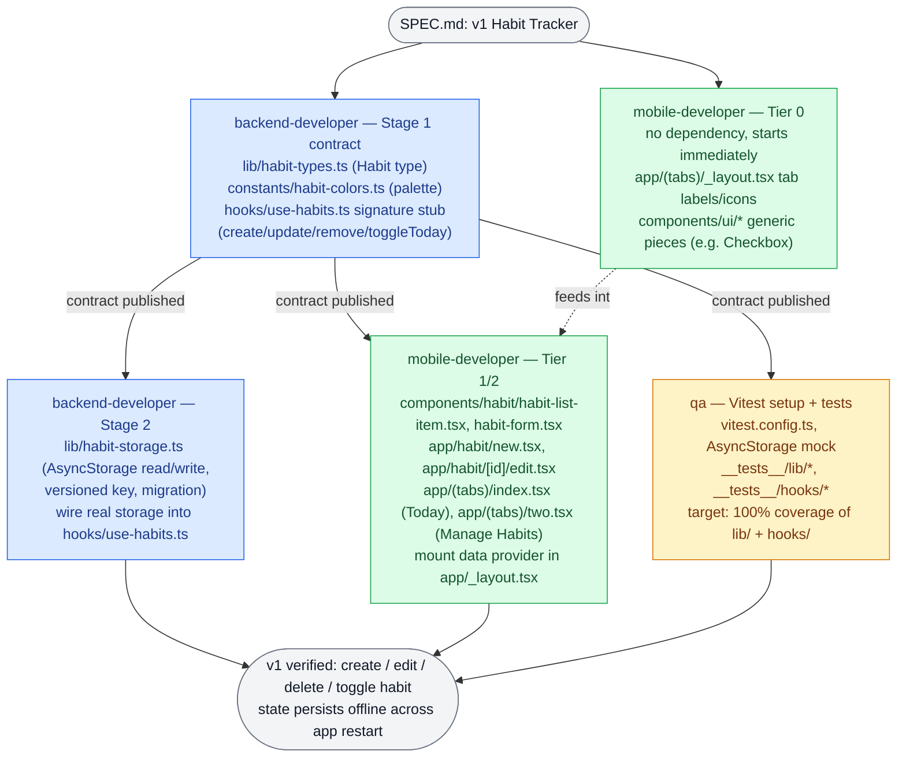

# Habit Tracker

A v1 mobile habit tracker built with Expo (Expo Router, React Native, NativeWind). Users create daily habits, check them off, edit or delete them, with everything persisted offline via AsyncStorage. See `SPEC.md` for the full spec and `AGENTS.md` for project conventions.

## Agent Team Workflow

This project's v1 implementation was built by three specialized Claude subagents defined in `.claude/agents/` — `backend-developer`, `mobile-developer`, and `qa` — coordinated so the UI and test workstreams don't have to wait on a fully finished data layer. `backend-developer` splits its work into two stages: Stage 1 publishes just the `Habit` type, the color palette, and the `use-habits` hook's exact function signatures (a stub, not real storage) as a stable contract; Stage 2 later swaps in real AsyncStorage persistence. Once Stage 1 is published, `mobile-developer` (for anything touching the `Habit` type or the hook) and `qa` both start immediately and run fully in parallel with each other and with `backend-developer`'s Stage 2 work — while a slice of `mobile-developer`'s work (tab layout/icons, generic `components/ui/*`) has no dependency at all and starts from the very beginning.

Each agent edits only the files it owns (see each `.claude/agents/*.md` for the exact file list), never touches `ios/`/`android/` (Continuous Native Generation), and asks before adding a dependency or changing the `Habit` shape. Before dispatching each agent, its task is classified with Jev (`typesafe/jev-1.13`) to pick the smallest capable model (tiny → Haiku 4.5, everyday → Sonnet 5, large → Opus 5.5, hardest → Fable 5.1), defaulting to Sonnet 5 when confidence is below 0.8 or the Jev call fails.
